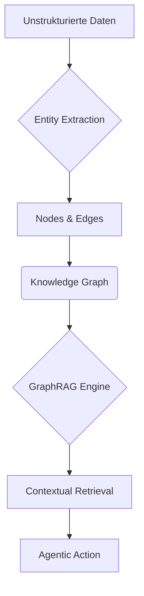

# GraphRAG: Orchestrating the Enterprise Brain
## Deep Context Retrieval for Agentic AI
Community Demo | AI Engineering | 2026

---

## Die Situation: Das RAG-Paradoxon
- **Daten:** Unternehmen sitzen auf Petabytes unstrukturierter Daten
- **Suche:** Vektor-Suche findet Ähnlichkeiten, versteht aber keine Zusammenhänge
- **Cloud:** LLMs sind bereit, aber der Kontext-Engpass limitiert die Performance

---

## Die Herausforderung (Complication)
- **Problem:** "Halluzinationen" bei komplexen, domänenübergreifenden Fragen
- **Kosten:** Token-Verschwendung durch redundante Context-Chunks
- **Security:** Fehlende Daten-Souveränität in der Retrieval-Pipeline

---

## Architektur: Das Knowledge Graph System

---

## Die Lösung: Graph-Augmented Retrieval (Answer)
- **AI-Native:** Mapping von Entitäten und Relationen statt nur Text-Snippets
- **Intelligence:** Höheres semantisches Verständnis durch Community-Erkennung
- **Efficiency:** Drastische Reduktion von Noise in der Prompt-Zusammenstellung

---

## Business Impact & Performance
- **95% Accuracy:** Reduktion von Halluzinationen bei Multi-Hop-Queries
- **40% Speed:** Schnelleres Retrieval durch vorstrukturierte Indexe
- **Safety:** Transparente Herleitung jeder Antwort (Explainable AI)

---

## Roadmap: Skalierung zum Enterprise-Gehirn
- **Q1:** Integration der Telekom Core-Ontologie
- **Q2:** Rollout auf Customer Service Agenten
- **Q3:** Autonome Graph-Updates in Echtzeit
- **Q4:** Full Agentic Orchestration

⚠ **Gefahr:** Ohne saubere Graph-Struktur wird die AI zum "Architecture Astronaut".
